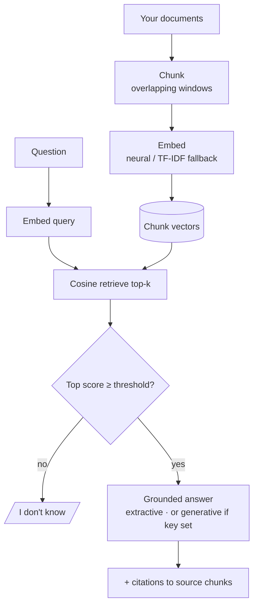

# Production-Style RAG Document Assistant

🔗 [**🤗 Live demo on Hugging Face »**](https://huggingface.co/spaces/FurqanAli12345/rag-document-assistant)

Ask questions about your own documents — answers are grounded in your text, cited to the source, and the assistant says **"I don't know"** instead of guessing.

## Overview

General chatbots hallucinate and can't see your documents. Retrieval-Augmented Generation (RAG) fixes both: it retrieves the passages most relevant to your question and answers *only* from them, with citations. This Space is a compact, honest demonstration of that pipeline.

## Demo

1. Upload `.txt` / `.md` / `.pdf` documents (or click **Load sample docs** — a fictional company handbook).
2. Build the index.
3. Ask a question. You get an answer, the mode used, and the exact source chunks it came from.

Try: *"What is the refund window?"*, *"How do I reset my password?"*, *"What are the support hours?"*

## Key Capabilities

- **Overlapping, sentence-aware chunking** so context isn't cut at boundaries
- **Neural embeddings** (`sentence-transformers`) with a **pure-Python TF-IDF fallback** — the Space runs even if the model can't load
- **Cosine-similarity retrieval** over chunk vectors
- **Grounded answers with citations** to source + chunk
- **Honest refusal**: returns "I don't know" below a similarity threshold
- **Key-free by default**; optional LLM key upgrades to generative answers

## Architecture



## Technical Stack

Python 3.11 · Gradio · NumPy · sentence-transformers (optional, with TF-IDF fallback) · pypdf. Optional generation via Gemini or OpenAI when a key is supplied.

## AI / ML Engineering Notes

- **Embedding model**: `sentence-transformers/all-MiniLM-L6-v2` when available — small, fast, CPU-friendly. Falls back to a TF-IDF vectoriser (`rag.TfidfEmbedder`) implemented from scratch, so retrieval degrades gracefully instead of failing.
- **Chunking strategy**: sentence-aware packing into ~600-char windows with ~100-char overlap.
- **Retrieval**: in-memory cosine similarity (no external vector store needed at this scale) — the `Retriever` interface is store-agnostic and could be swapped for FAISS/Chroma.
- **Grounding & hallucination control**: answers are assembled only from retrieved chunks; a similarity threshold triggers an explicit "I don't know".
- **Reproducibility**: the retrieval logic takes an injectable embedder, so it is unit-tested deterministically without any model download.

## Evaluation

Covered by a pytest suite: chunking coverage/overlap, relevant-chunk retrieval, grounded-answer citation, threshold-based refusal on off-topic questions, and empty-index safety. No accuracy metric is claimed on a benchmark — behaviour is defined by these tests. Retrieval quality depends on which embedder is active.

## Security & Privacy

- **No secrets or private data** are included; the Space runs key-free.
- Uploaded documents are processed **in-memory** and not persisted; `.gitignore` blocks any `uploads/` from being committed.
- LLM keys (only if you enable generation) are read from **environment / HF Secrets**, never hard-coded.
- The assistant answers only from provided context and refuses when unsupported, limiting prompt-injection-driven fabrication.

## Limitations

- Free CPU tier: on first load the neural model downloads; if that isn't possible the TF-IDF fallback is used (lower semantic quality, still functional).
- Extractive mode returns the most relevant passage verbatim; enable an LLM key for synthesised answers.
- Small in-memory index — designed for demo-sized document sets, not millions of pages.

## Local Development

```bash
pip install -r requirements.txt
python app.py            # http://localhost:7860
pytest -q                # runs on the TF-IDF path, no model download
```

## Project Structure

```
app.py                 # Gradio UI (this Space)
rag.py                 # chunk → embed (neural/TF-IDF) → retrieve → grounded answer
sample_docs/           # fictional handbook for the demo
tests/                 # RAG logic tests (model-free)
requirements.txt
```

## Future Improvements

- Swap the in-memory index for FAISS/Chroma at larger scale.
- Streaming generative answers and multi-turn chat memory.
- Per-source highlighting of the exact sentence used.

## License

MIT. Source & profile: https://github.com/furqunali
